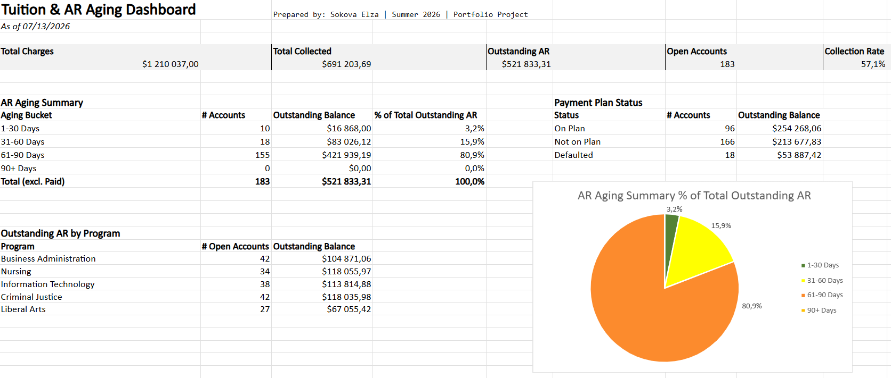
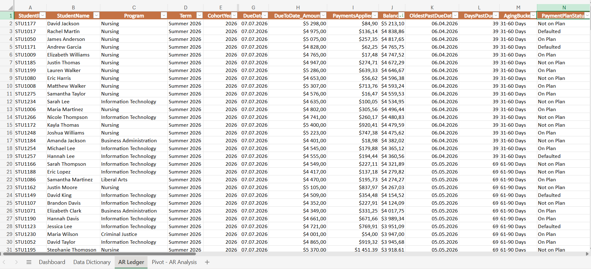

# Tuition & AR Aging Dashboard (Excel)

Portfolio project demonstrating **reporting and analytics skills** for college bursar / student accounts work.

**Author:** Sokova Elza  
**Term:** Summer 2026 &nbsp;|&nbsp; **As of:** July 13, 2026 &nbsp;|&nbsp; **Data:** 100% synthetic

---

## Problem

College bursar offices need a clear view of **current-term tuition receivables** — who owes money, how much is past due, and which accounts need collections follow-up before balances move into 90+ day buckets.

This workbook models that workflow for a single active term (**Summer 2026**), showing outstanding balances **as of today's date**, not historical or multi-term totals.

---

## Approach

Built an Excel dashboard using **280 synthetic student billing records** across five academic programs:

| Design choice | Why it matters |
|---------------|----------------|
| **Single term (Summer 2026)** | Focuses on in-semester collections, not mixed historical AR |
| **DueToDate_Amount** | Amount scheduled to be paid by the report date — not full term charge when a payment plan is active |
| **OldestPastDueDate** | Date of the first missed installment — used for accurate aging |
| **BalanceDue = DueToDate − Payments** | Outstanding amount tied to what's due today |

---

## Screenshots

### Dashboard


### AR Ledger


---

## What's Inside

| Sheet | Purpose |
|-------|---------|
| **Dashboard** | KPIs, AR aging summary, payment plan status, outstanding AR by program |
| **AR Ledger** | Source data with formulas (DaysPastDue, AgingBucket, BalanceDue) |
| **Pivot - AR Analysis** | Outstanding balance by aging bucket × program |
| **Data Dictionary** | Column definitions |

---

## Key Metrics (As of 07/13/2026)

| KPI | Value |
|-----|-------|
| Total Charges | $1,210,037 |
| Total Collected | $691,204 |
| Outstanding AR | $521,833 |
| Open Accounts | 183 |
| Collection Rate | 57.1% |

### AR Aging Summary

| Aging Bucket | # Accounts | Outstanding | % of Total Outstanding AR |
|--------------|-------------|---------------|---------------------------|
| 1–30 Days | 10 | $16,868 | 3.2% |
| 31–60 Days | 18 | $83,026 | 15.9% |
| 61–90 Days | 155 | $421,939 | **80.9%** |
| 90+ Days | 0 | $0 | 0.0% |

### Payment Plan Status

| Status | # Accounts | Outstanding |
|--------|-------------|-------------|
| On Plan | 96 | $254,268 |
| Not on Plan | 166 | $213,678 |
| Defaulted | 18 | $53,887 |

---

## Key Insight

> **81% of outstanding Summer 2026 AR is in the 61–90 day bucket** — collections should prioritize these accounts before they reach 90+ days and require escalated follow-up (registration holds, payment plan cancellation).

---

## Sample Formulas

**BalanceDue:**
```excel
= DueToDate_Amount - PaymentsApplied
```

**Days Past Due:**
```excel
= IF(BalanceDue<=0, 0, IF(OldestPastDueDate="", 0, MAX(0, AsOfDate - OldestPastDueDate)))
```

**Aging Bucket:**
```excel
= IF(BalanceDue<=0, "Paid",
    IF(DaysPastDue=0, "Current",
      IF(DaysPastDue<=30, "1-30 Days",
        IF(DaysPastDue<=60, "31-60 Days",
          IF(DaysPastDue<=90, "61-90 Days", "90+ Days")))))
```

**% of Total Outstanding AR:**
```excel
= Bucket Outstanding Balance / Total Outstanding AR
```

---

## Excel Skills Demonstrated

`SUMIFS` · `COUNTIFS` · `SUMIF` · `COUNTIF` · nested `IF` · `MAX` · `IFERROR` · Pivot Tables · Pie Chart · AutoFilter · Data Dictionary

---

## Repository Structure

```
Pet Project/
├── README.md
├── LICENSE
├── .gitignore
├── account-receivable-aging-dashboard.xlsx
└── screenshots/
    ├── dashboard.png
    └── ar-ledger.png
```

---

## Disclaimer

All student names, IDs, and financial data are **100% synthetic**. No real student or institutional data was used.

---

## Author

**Sokova Elza** — built as a portfolio project targeting **Reporting Analyst** roles in higher education finance.

**Skills:** Excel · Pivot Tables · AR Aging · Higher Ed Finance · Accounts Receivable · Reporting

**License:** [CC BY 4.0](LICENSE) — attribution required if shared or adapted.

---

*If you have questions or feedback, feel free to open an issue.*
